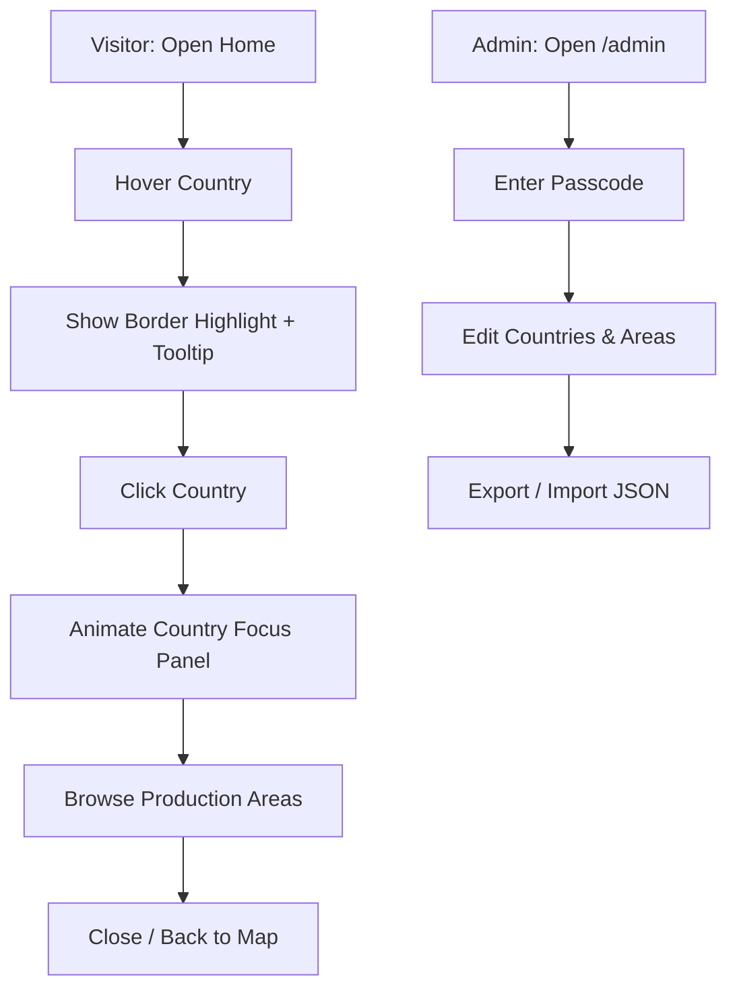

## 1. Product Overview
Coffee Origin Atlas is a map-first website that lets people explore coffee-producing countries and their regions, varieties, and processing details.
- Helps coffee buyers, roasters, and enthusiasts learn origins quickly and consistently
- Provides an admin-only editor to maintain accurate origin information without touching code

## 2. Core Features

### 2.1 User Roles
| Role | Access Method | Core Permissions |
|------|---------------|------------------|
| Visitor | Public access | Browse world map, open country details, search/filter within a country |
| Admin | Passcode gate (MVP) | Create/edit/delete country + production area info, import/export data |

### 2.2 Feature Module
1. **Map Explorer (Home)**: Robinson-projection world map, hover highlight borders, click-to-focus country panel, map fades into background
2. **Country Detail Experience**: left-side expanded country silhouette + content, production area cards, filters (variety/process/altitude), quick facts
3. **Admin (CMS)**: CRUD for countries and production areas, validation, data import/export

### 2.3 Page Details
| Page Name | Module Name | Feature description |
|-----------|-------------|---------------------|
| / | World map | Robinson projection, pan/zoom optional (MVP: disabled), country hover border bolding, tooltip with country name |
| / | Focus transition | On click: selected country animates/expands to left half, rest of map remains as faded background |
| / | Country content | Key facts (climate, harvest months, typical profiles), list of production areas with rich fields |
| /admin | Auth gate | Simple passcode modal (MVP), lock when refreshed |
| /admin | Country editor | Country metadata (name, ISO code), hero image optional, notes, save/delete |
| /admin | Area editor | Production areas (region name, altitude range, varieties, processes, tasting notes, seasonality, links) |
| /admin | Import/export | Export JSON, import JSON with preview + conflict handling (overwrite/merge) |

## 3. Core Process
Visitor flow:
- Open home → hover countries → click a country → country expands left → read/filter production areas → close to return to map

Admin flow:
- Open /admin → enter passcode → manage countries/areas → export/import data → publish by sharing the site (MVP persistence is local)

## 4. User Interface Design
### 4.1 Design Style
- Aesthetic direction: editorial + cartographic (atlas-like), rich paper textures, restrained palette, high-contrast ink borders on hover
- Primary colors: parchment background, deep espresso, muted greens for producing regions, saffron accents for UI focus states
- Buttons: crisp, minimal, slightly rounded, subtle shadow; strong hover transitions
- Typography: distinctive display serif for headings + readable humanist sans for body
- Layout: full-bleed map canvas; left content panel with layered glass/paper effect; background map fades when focused
- Icon style: minimal line icons with small coffee/terrain hints

### 4.2 Page Design Overview
| Page Name | Module Name | UI Elements |
|-----------|-------------|-------------|
| / | Map canvas | Large SVG map, ocean gradient, country fills, hover border thickening, country label tooltip |
| / | Focus panel | Left 50% panel, country silhouette/background watermark, stacked content sections, smooth slide-in/expand animation |
| / | Area cards | Region name, chips (variety/process), altitude, profile notes; collapsible details |
| /admin | CMS shell | Split view (list + editor), autosave indicator, validation errors inline |

### 4.3 Responsiveness
- Desktop-first; on smaller screens switch to top sheet (country detail) instead of left half split
- Touch: hover replaced by tap-to-preview tooltip, second tap to open

### 4.4 3D Scene Guidance
Not applicable.
