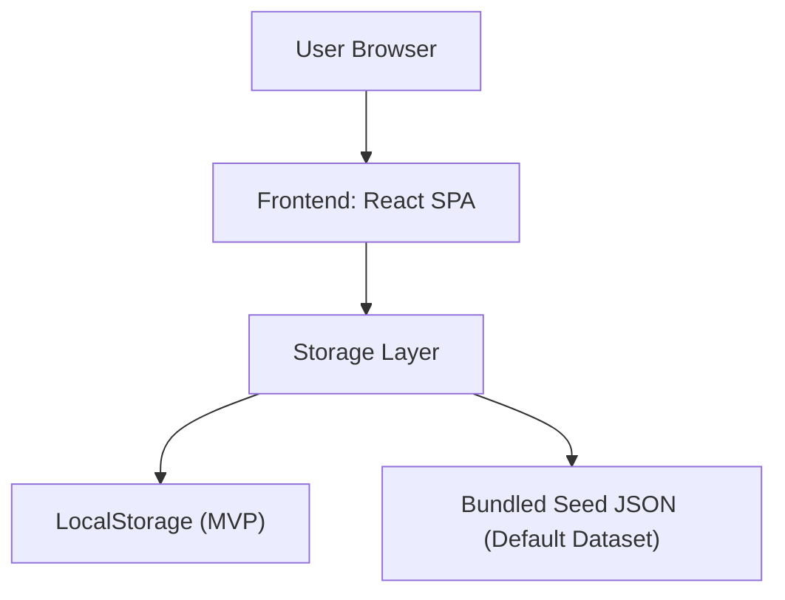
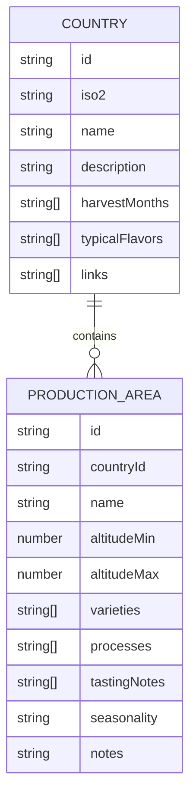

## 1. Architecture Design

## 2. Technology Description
- Frontend: React@18 + TypeScript + tailwindcss@3 + vite
- Rendering: SVG map with d3-geo + topojson-client
- Projection: Robinson (d3-geo-projection)
- State: React state + lightweight store (context or zustand if already needed; default: context)
- Data: Seed JSON shipped with app; persisted edits stored in LocalStorage (MVP)
- Admin security: Passcode gate stored as hash in env at build time (MVP), not production-grade authentication

## 3. Route Definitions
| Route | Purpose |
|-------|---------|
| / | Interactive world map + country focus detail panel |
| /admin | Admin CMS for editing/export/import of country and production area data |

## 4. API Definitions
No backend APIs in MVP.

## 5. Server Architecture Diagram
Not applicable (no backend in MVP).

## 6. Data Model
### 6.1 Data Model Definition

### 6.2 Data Definition Language
No DDL in MVP (LocalStorage + JSON).
